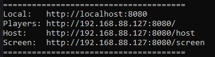
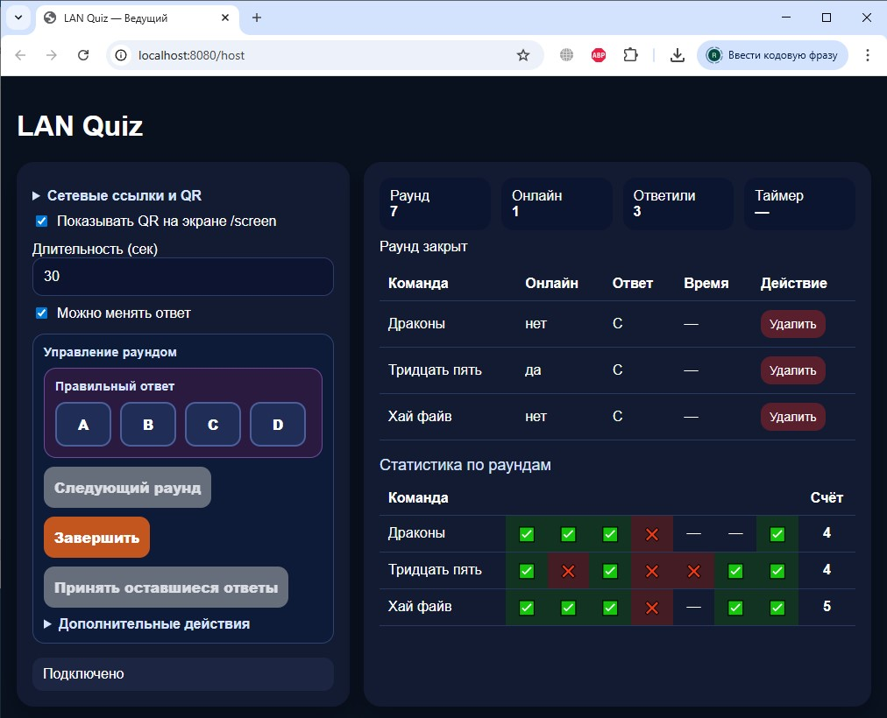
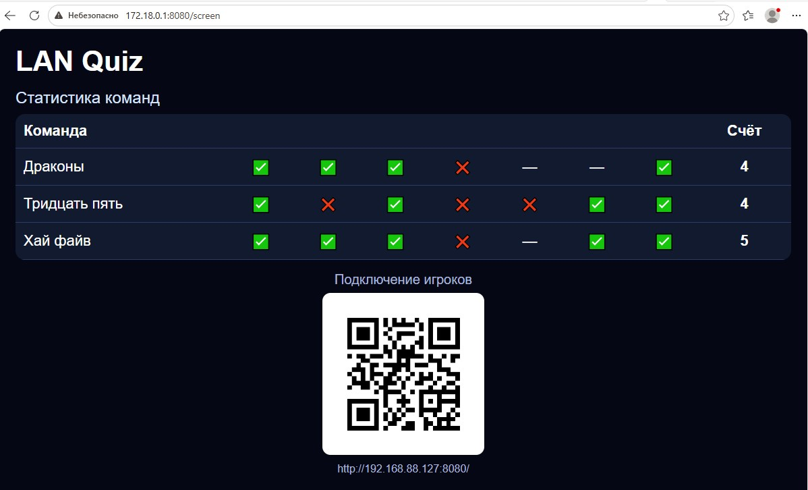
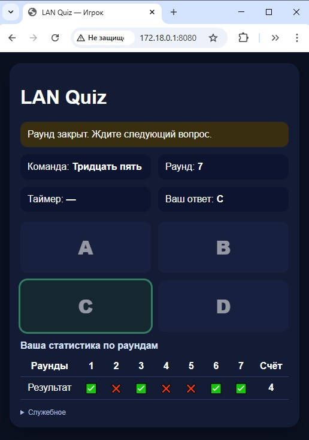

`LAN Quiz` — локальный веб-сервер для проведения викторины в одной сети.

Программа работает через браузер, отдельные приложения игрокам устанавливать не нужно.

- Ведущий запускает веб-сервер на компьютере под управлением Windows: файл `quiz-host.exe`.

- После запуска у ведущего автоматически открывается host-экран: `http://localhost:8080/host`.

- Также доступен экран `/screen` со статистикой, например `http://192.168.88.127:8080/screen`. Его можно открыть у ведущего и вывести через проектор.

- Ведущий может показать QR-код для подключения или сообщить адрес вручную.
- Все участники должны быть подключены к одной Wi‑Fi-сети.
- Участники (команды) подключаются со своих телефонов по указанному адресу и вводят название команды.
- По мере подключения у ведущего отображаются подключённые команды, сортировка — по алфавиту.
- Если команда удалена ведущим, у игрока автоматически снова открывается форма ввода имени команды.
- Ведущий управляет раундами на странице ведущего.
- Для начала раунда ведущему достаточно выбрать правильный ответ — запустится таймер.
- Участники видят, что раунд начался, и выбирают ответ: **A / B / C / D**.

- Раунд завершается, когда таймер досчитает до нуля, или по кнопке «Завершить» у ведущего.
- Если некоторые участники не ответили (например, ждут подсказку), их ответы можно принять позже кнопкой «Принять оставшиеся ответы».
- Когда раунд завершён, у участников показывается их вариант ответа и правильный вариант.
- После завершения текущего раунда кнопкой «Следующий раунд» можно перейти к следующему.
- Кнопка «Следующий раунд» активируется только когда текущий раунд завершён и ответ зафиксирован.
- У ведущего отображается статистика по всем командам, у каждого игрока — только своя.
- Если нужно повторно провести текущий раунд, используйте кнопку **«Переиграть раунд»** (в дополнительных действиях).
- Текущее состояние игры автоматически сохраняется в файл `data/state.json` (команды, текущий раунд, ответы и история).
- Начать новую серию раундов можно кнопкой «Сброс статистики и раундов» в блоке «Дополнительные действия».
- При сбросе статистики предыдущие данные сохраняются в CSV-файл в папке `data/stats/`.
- На экране `.../screen` показывается только статистика, а QR — только если включена соответствующая галочка у ведущего.
